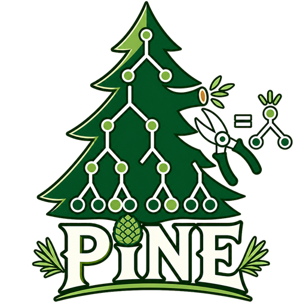

# [ICML'26] PINE: Pruning Boosted Tree Ensembles with Conformal In-Distribution Prediction Equivalence

<p align="center">
  <a href="https://haruk1y.github.io/pine-icml/">
    
  </a>
</p>

<p align="center">
  <a href="https://haruk1y.github.io/pine-icml/"></a>
  <a href="https://arxiv.org/abs/2605.28068"></a>
  <a href="https://github.com/Haruk1y/pine"></a>
  
</p>

<p align="center">
  <a href="https://haruk1y.github.io/"><strong>Haruki Yajima</strong></a> and <a href="https://yusukematsui.me/index_jp.html"><strong>Yusuke Matsui</strong></a><br>
  The University of Tokyo<br>
  Accepted to <strong>ICML 2026</strong>
</p>

This repository hosts the project page for **PINE**, a pruning method for boosted tree ensembles that preserves prediction equivalence inside conformal in-distribution regions.

## Overview

Tree ensembles remain strong and interpretable models for tabular data, but pruning them often trades compression for changes in predictions. Existing faithful pruning methods preserve prediction equivalence over the entire input space, which can limit compression because they also constrain rarely observed out-of-distribution regions.

**PINE** relaxes this requirement in a controlled way: it guarantees prediction equivalence within an in-distribution region calibrated by conformal prediction. This gives a tunable equivalence-compression trade-off and improves the compression ratio by up to **30%** while maintaining comparable prediction equivalence to faithful pruning baselines.

## Links

- [Project page](https://haruk1y.github.io/pine-icml/)
- [arXiv](https://arxiv.org/abs/2605.28068)
- [Code](https://github.com/Haruk1y/pine)

## Local Preview

```bash
cd /Users/yajima/Documents/hal/pine-icml
python3 -m http.server 8000
```

Then open:

```text
http://127.0.0.1:8000/
```

## Citation

```bibtex
@inproceedings{yajima2026pine,
  title={PINE: Pruning Boosted Tree Ensembles with Conformal In-Distribution Prediction Equivalence},
  author={Yajima, Haruki and Matsui, Yusuke},
  booktitle={Proceedings of the International Conference on Machine Learning},
  year={2026}
}
```

## Acknowledgments

This project page is based on the [Academic Project Page Template](https://github.com/eliahuhorwitz/Academic-project-page-template), which was adopted from the [Nerfies](https://nerfies.github.io/) project page.
